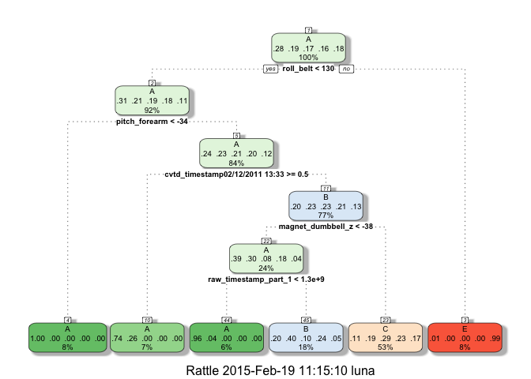
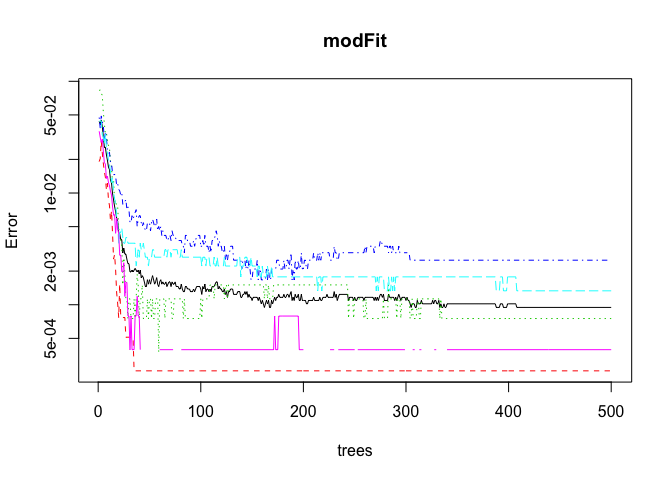

# PML Project
Luna Gui  
16 February 2015  

# Summary
In this project, our goal will be to use data from accelerometers on the belt, forearm, arm, and dumbell of 6 participants. They were asked to perform barbell lifts correctly and incorrectly in 5 different ways. More information is available from the website here: [http://groupware.les.inf.puc-rio.br/har](http://groupware.les.inf.puc-rio.br/har).   

**The training set has 160 variables. The goal is to predict the manner in which they did the exercise. This is the "classe" variable in the training set. So we explor data, build our model, and predict which exercise they did in testing set.**  

# Get Clean Data

```r
## Download data
trainUrl <- "https://d396qusza40orc.cloudfront.net/predmachlearn/pml-training.csv"
testUrl <- "https://d396qusza40orc.cloudfront.net/predmachlearn/pml-testing.csv"
download.file(trainUrl, destfile = "pml_training.csv", method = "curl")
download.file(testUrl, destfile = "pml_testing.csv", method = "curl")
dateDownloaded <- date()
## Read data
training <- read.csv("pml_training.csv",na.strings=c("","NA"))
testing <- read.csv("pml_testing.csv",na.strings=c("","NA"))
str(training)
```

```
## 'data.frame':	19622 obs. of  160 variables:
##  $ X                       : int  1 2 3 4 5 6 7 8 9 10 ...
##  $ user_name               : Factor w/ 6 levels "adelmo","carlitos",..: 2 2 2 2 2 2 2 2 2 2 ...
##  $ raw_timestamp_part_1    : int  1323084231 1323084231 1323084231 1323084232 1323084232 1323084232 1323084232 1323084232 1323084232 1323084232 ...
##  $ raw_timestamp_part_2    : int  788290 808298 820366 120339 196328 304277 368296 440390 484323 484434 ...
##  $ cvtd_timestamp          : Factor w/ 20 levels "02/12/2011 13:32",..: 9 9 9 9 9 9 9 9 9 9 ...
##  $ new_window              : Factor w/ 2 levels "no","yes": 1 1 1 1 1 1 1 1 1 1 ...
##  $ num_window              : int  11 11 11 12 12 12 12 12 12 12 ...
##  $ roll_belt               : num  1.41 1.41 1.42 1.48 1.48 1.45 1.42 1.42 1.43 1.45 ...
##  $ pitch_belt              : num  8.07 8.07 8.07 8.05 8.07 8.06 8.09 8.13 8.16 8.17 ...
##  $ yaw_belt                : num  -94.4 -94.4 -94.4 -94.4 -94.4 -94.4 -94.4 -94.4 -94.4 -94.4 ...
##  $ total_accel_belt        : int  3 3 3 3 3 3 3 3 3 3 ...
##  $ kurtosis_roll_belt      : Factor w/ 396 levels "-0.016850","-0.021024",..: NA NA NA NA NA NA NA NA NA NA ...
##  $ kurtosis_picth_belt     : Factor w/ 316 levels "-0.021887","-0.060755",..: NA NA NA NA NA NA NA NA NA NA ...
##  $ kurtosis_yaw_belt       : Factor w/ 1 level "#DIV/0!": NA NA NA NA NA NA NA NA NA NA ...
##  $ skewness_roll_belt      : Factor w/ 394 levels "-0.003095","-0.010002",..: NA NA NA NA NA NA NA NA NA NA ...
##  $ skewness_roll_belt.1    : Factor w/ 337 levels "-0.005928","-0.005960",..: NA NA NA NA NA NA NA NA NA NA ...
##  $ skewness_yaw_belt       : Factor w/ 1 level "#DIV/0!": NA NA NA NA NA NA NA NA NA NA ...
##  $ max_roll_belt           : num  NA NA NA NA NA NA NA NA NA NA ...
##  $ max_picth_belt          : int  NA NA NA NA NA NA NA NA NA NA ...
##  $ max_yaw_belt            : Factor w/ 67 levels "-0.1","-0.2",..: NA NA NA NA NA NA NA NA NA NA ...
##  $ min_roll_belt           : num  NA NA NA NA NA NA NA NA NA NA ...
##  $ min_pitch_belt          : int  NA NA NA NA NA NA NA NA NA NA ...
##  $ min_yaw_belt            : Factor w/ 67 levels "-0.1","-0.2",..: NA NA NA NA NA NA NA NA NA NA ...
##  $ amplitude_roll_belt     : num  NA NA NA NA NA NA NA NA NA NA ...
##  $ amplitude_pitch_belt    : int  NA NA NA NA NA NA NA NA NA NA ...
##  $ amplitude_yaw_belt      : Factor w/ 3 levels "#DIV/0!","0.00",..: NA NA NA NA NA NA NA NA NA NA ...
##  $ var_total_accel_belt    : num  NA NA NA NA NA NA NA NA NA NA ...
##  $ avg_roll_belt           : num  NA NA NA NA NA NA NA NA NA NA ...
##  $ stddev_roll_belt        : num  NA NA NA NA NA NA NA NA NA NA ...
##  $ var_roll_belt           : num  NA NA NA NA NA NA NA NA NA NA ...
##  $ avg_pitch_belt          : num  NA NA NA NA NA NA NA NA NA NA ...
##  $ stddev_pitch_belt       : num  NA NA NA NA NA NA NA NA NA NA ...
##  $ var_pitch_belt          : num  NA NA NA NA NA NA NA NA NA NA ...
##  $ avg_yaw_belt            : num  NA NA NA NA NA NA NA NA NA NA ...
##  $ stddev_yaw_belt         : num  NA NA NA NA NA NA NA NA NA NA ...
##  $ var_yaw_belt            : num  NA NA NA NA NA NA NA NA NA NA ...
##  $ gyros_belt_x            : num  0 0.02 0 0.02 0.02 0.02 0.02 0.02 0.02 0.03 ...
##  $ gyros_belt_y            : num  0 0 0 0 0.02 0 0 0 0 0 ...
##  $ gyros_belt_z            : num  -0.02 -0.02 -0.02 -0.03 -0.02 -0.02 -0.02 -0.02 -0.02 0 ...
##  $ accel_belt_x            : int  -21 -22 -20 -22 -21 -21 -22 -22 -20 -21 ...
##  $ accel_belt_y            : int  4 4 5 3 2 4 3 4 2 4 ...
##  $ accel_belt_z            : int  22 22 23 21 24 21 21 21 24 22 ...
##  $ magnet_belt_x           : int  -3 -7 -2 -6 -6 0 -4 -2 1 -3 ...
##  $ magnet_belt_y           : int  599 608 600 604 600 603 599 603 602 609 ...
##  $ magnet_belt_z           : int  -313 -311 -305 -310 -302 -312 -311 -313 -312 -308 ...
##  $ roll_arm                : num  -128 -128 -128 -128 -128 -128 -128 -128 -128 -128 ...
##  $ pitch_arm               : num  22.5 22.5 22.5 22.1 22.1 22 21.9 21.8 21.7 21.6 ...
##  $ yaw_arm                 : num  -161 -161 -161 -161 -161 -161 -161 -161 -161 -161 ...
##  $ total_accel_arm         : int  34 34 34 34 34 34 34 34 34 34 ...
##  $ var_accel_arm           : num  NA NA NA NA NA NA NA NA NA NA ...
##  $ avg_roll_arm            : num  NA NA NA NA NA NA NA NA NA NA ...
##  $ stddev_roll_arm         : num  NA NA NA NA NA NA NA NA NA NA ...
##  $ var_roll_arm            : num  NA NA NA NA NA NA NA NA NA NA ...
##  $ avg_pitch_arm           : num  NA NA NA NA NA NA NA NA NA NA ...
##  $ stddev_pitch_arm        : num  NA NA NA NA NA NA NA NA NA NA ...
##  $ var_pitch_arm           : num  NA NA NA NA NA NA NA NA NA NA ...
##  $ avg_yaw_arm             : num  NA NA NA NA NA NA NA NA NA NA ...
##  $ stddev_yaw_arm          : num  NA NA NA NA NA NA NA NA NA NA ...
##  $ var_yaw_arm             : num  NA NA NA NA NA NA NA NA NA NA ...
##  $ gyros_arm_x             : num  0 0.02 0.02 0.02 0 0.02 0 0.02 0.02 0.02 ...
##  $ gyros_arm_y             : num  0 -0.02 -0.02 -0.03 -0.03 -0.03 -0.03 -0.02 -0.03 -0.03 ...
##  $ gyros_arm_z             : num  -0.02 -0.02 -0.02 0.02 0 0 0 0 -0.02 -0.02 ...
##  $ accel_arm_x             : int  -288 -290 -289 -289 -289 -289 -289 -289 -288 -288 ...
##  $ accel_arm_y             : int  109 110 110 111 111 111 111 111 109 110 ...
##  $ accel_arm_z             : int  -123 -125 -126 -123 -123 -122 -125 -124 -122 -124 ...
##  $ magnet_arm_x            : int  -368 -369 -368 -372 -374 -369 -373 -372 -369 -376 ...
##  $ magnet_arm_y            : int  337 337 344 344 337 342 336 338 341 334 ...
##  $ magnet_arm_z            : int  516 513 513 512 506 513 509 510 518 516 ...
##  $ kurtosis_roll_arm       : Factor w/ 329 levels "-0.02438","-0.04190",..: NA NA NA NA NA NA NA NA NA NA ...
##  $ kurtosis_picth_arm      : Factor w/ 327 levels "-0.00484","-0.01311",..: NA NA NA NA NA NA NA NA NA NA ...
##  $ kurtosis_yaw_arm        : Factor w/ 394 levels "-0.01548","-0.01749",..: NA NA NA NA NA NA NA NA NA NA ...
##  $ skewness_roll_arm       : Factor w/ 330 levels "-0.00051","-0.00696",..: NA NA NA NA NA NA NA NA NA NA ...
##  $ skewness_pitch_arm      : Factor w/ 327 levels "-0.00184","-0.01185",..: NA NA NA NA NA NA NA NA NA NA ...
##  $ skewness_yaw_arm        : Factor w/ 394 levels "-0.00311","-0.00562",..: NA NA NA NA NA NA NA NA NA NA ...
##  $ max_roll_arm            : num  NA NA NA NA NA NA NA NA NA NA ...
##  $ max_picth_arm           : num  NA NA NA NA NA NA NA NA NA NA ...
##  $ max_yaw_arm             : int  NA NA NA NA NA NA NA NA NA NA ...
##  $ min_roll_arm            : num  NA NA NA NA NA NA NA NA NA NA ...
##  $ min_pitch_arm           : num  NA NA NA NA NA NA NA NA NA NA ...
##  $ min_yaw_arm             : int  NA NA NA NA NA NA NA NA NA NA ...
##  $ amplitude_roll_arm      : num  NA NA NA NA NA NA NA NA NA NA ...
##  $ amplitude_pitch_arm     : num  NA NA NA NA NA NA NA NA NA NA ...
##  $ amplitude_yaw_arm       : int  NA NA NA NA NA NA NA NA NA NA ...
##  $ roll_dumbbell           : num  13.1 13.1 12.9 13.4 13.4 ...
##  $ pitch_dumbbell          : num  -70.5 -70.6 -70.3 -70.4 -70.4 ...
##  $ yaw_dumbbell            : num  -84.9 -84.7 -85.1 -84.9 -84.9 ...
##  $ kurtosis_roll_dumbbell  : Factor w/ 397 levels "-0.0035","-0.0073",..: NA NA NA NA NA NA NA NA NA NA ...
##  $ kurtosis_picth_dumbbell : Factor w/ 400 levels "-0.0163","-0.0233",..: NA NA NA NA NA NA NA NA NA NA ...
##  $ kurtosis_yaw_dumbbell   : Factor w/ 1 level "#DIV/0!": NA NA NA NA NA NA NA NA NA NA ...
##  $ skewness_roll_dumbbell  : Factor w/ 400 levels "-0.0082","-0.0096",..: NA NA NA NA NA NA NA NA NA NA ...
##  $ skewness_pitch_dumbbell : Factor w/ 401 levels "-0.0053","-0.0084",..: NA NA NA NA NA NA NA NA NA NA ...
##  $ skewness_yaw_dumbbell   : Factor w/ 1 level "#DIV/0!": NA NA NA NA NA NA NA NA NA NA ...
##  $ max_roll_dumbbell       : num  NA NA NA NA NA NA NA NA NA NA ...
##  $ max_picth_dumbbell      : num  NA NA NA NA NA NA NA NA NA NA ...
##  $ max_yaw_dumbbell        : Factor w/ 72 levels "-0.1","-0.2",..: NA NA NA NA NA NA NA NA NA NA ...
##  $ min_roll_dumbbell       : num  NA NA NA NA NA NA NA NA NA NA ...
##  $ min_pitch_dumbbell      : num  NA NA NA NA NA NA NA NA NA NA ...
##  $ min_yaw_dumbbell        : Factor w/ 72 levels "-0.1","-0.2",..: NA NA NA NA NA NA NA NA NA NA ...
##  $ amplitude_roll_dumbbell : num  NA NA NA NA NA NA NA NA NA NA ...
##   [list output truncated]
```

**For the first glance, we found there are lots of missing data. I dicied to drop all the colums if they contains 80% missing data.** 

```r
## Clean data
nullcol <- c()
for(i in 1:dim(training)[2]){
        p <- sum(is.na(training[,i]))/19622
        if(p>0.8){
                nullcol <- c(nullcol, i)
        }
}
library(dplyr)
```

```
## 
## Attaching package: 'dplyr'
## 
## The following objects are masked from 'package:stats':
## 
##     filter, lag
## 
## The following objects are masked from 'package:base':
## 
##     intersect, setdiff, setequal, union
```

```r
myDT <- select(training, -nullcol)
## I don't think index and name good for predict, just drop them too
myDT <- select(myDT, 3:60)
## Check again
sum(!complete.cases(myDT))
```

```
## [1] 0
```

# Explor Data
**We plan to fit different model, and chose one performed best. We split our clean data into myTrain and myTest set, in case we need OOB error.(Also because we have lost of observations.)**

```r
## Split training data into myTrain and myTest data set.
library(caret)
```

```
## Loading required package: lattice
## Loading required package: ggplot2
```

```r
inTrain <- createDataPartition(y=myDT$classe,
                              p=0.7, list=FALSE)
myTrain <- myDT[inTrain,]
myTest <- myDT[-inTrain,]
table(myTrain$classe)
```

```
## 
##    A    B    C    D    E 
## 3906 2658 2396 2252 2525
```

```r
## Fit rpart model
modrpart <- train(classe~ ., data= myTrain, method= "rpart")
```

```
## Loading required package: rpart
```

```r
modrpart
```

```
## CART 
## 
## 13737 samples
##    57 predictor
##     5 classes: 'A', 'B', 'C', 'D', 'E' 
## 
## No pre-processing
## Resampling: Bootstrapped (25 reps) 
## 
## Summary of sample sizes: 13737, 13737, 13737, 13737, 13737, 13737, ... 
## 
## Resampling results across tuning parameters:
## 
##   cp       Accuracy  Kappa    Accuracy SD  Kappa SD
##   0.03962  0.5363    0.39658  0.10598      0.15790 
##   0.04465  0.4199    0.21809  0.07608      0.12956 
##   0.11484  0.3156    0.04786  0.04059      0.05987 
## 
## Accuracy was used to select the optimal model using  the largest value.
## The final value used for the model was cp = 0.03962.
```

```r
library(rattle)
```

```
## Rattle: A free graphical interface for data mining with R.
## Version 3.4.1 Copyright (c) 2006-2014 Togaware Pty Ltd.
## Type 'rattle()' to shake, rattle, and roll your data.
```

```r
fancyRpartPlot(modrpart$finalModel)
```

 

```r
confusionMatrix(predict(modrpart, myTrain), myTrain$classe)
```

```
## Confusion Matrix and Statistics
## 
##           Reference
## Prediction    A    B    C    D    E
##          A 2578  272    2    0    0
##          B  492  965  251  597  134
##          C  826 1421 2143 1655 1252
##          D    0    0    0    0    0
##          E   10    0    0    0 1139
## 
## Overall Statistics
##                                         
##                Accuracy : 0.497         
##                  95% CI : (0.488, 0.505)
##     No Information Rate : 0.284         
##     P-Value [Acc > NIR] : <2e-16        
##                                         
##                   Kappa : 0.37          
##  Mcnemar's Test P-Value : NA            
## 
## Statistics by Class:
## 
##                      Class: A Class: B Class: C Class: D Class: E
## Sensitivity             0.660   0.3631    0.894    0.000   0.4511
## Specificity             0.972   0.8670    0.546    1.000   0.9991
## Pos Pred Value          0.904   0.3957    0.294      NaN   0.9913
## Neg Pred Value          0.878   0.8502    0.961    0.836   0.8899
## Prevalence              0.284   0.1935    0.174    0.164   0.1838
## Detection Rate          0.188   0.0702    0.156    0.000   0.0829
## Detection Prevalence    0.208   0.1775    0.531    0.000   0.0836
## Balanced Accuracy       0.816   0.6150    0.720    0.500   0.7251
```

**We know this rpart model is not good even don't need to test. Look at the plot, the classe miss one. Obviously, the in sample error is very high, and we don't need to see out sample error.**  

# Result

```r
## Fit random forest model
library(randomForest)
modFit <- randomForest(classe ~ .,data=myTrain)
modFit
```

```
## 
## Call:
##  randomForest(formula = classe ~ ., data = myTrain) 
##                Type of random forest: classification
##                      Number of trees: 500
## No. of variables tried at each split: 7
## 
##         OOB estimate of  error rate: 0.09%
## Confusion matrix:
##      A    B    C    D    E class.error
## A 3905    1    0    0    0   0.0002560
## B    2 2656    0    0    0   0.0007524
## C    0    4 2390    2    0   0.0025042
## D    0    0    1 2249    2   0.0013321
## E    0    0    0    1 2524   0.0003960
```
**The random forest model performs quite good. OOB estimate of  error rate between 0.1% ~ 0.2%. **  

```r
plot(modFit, log="y")
```

```
## Warning: 76 y values <= 0 omitted from logarithmic plot
```

 

```r
confusionMatrix(predict(modFit, myTrain), myTrain$classe)
```

```
## Confusion Matrix and Statistics
## 
##           Reference
## Prediction    A    B    C    D    E
##          A 3906    0    0    0    0
##          B    0 2658    0    0    0
##          C    0    0 2396    0    0
##          D    0    0    0 2252    0
##          E    0    0    0    0 2525
## 
## Overall Statistics
##                                 
##                Accuracy : 1     
##                  95% CI : (1, 1)
##     No Information Rate : 0.284 
##     P-Value [Acc > NIR] : <2e-16
##                                 
##                   Kappa : 1     
##  Mcnemar's Test P-Value : NA    
## 
## Statistics by Class:
## 
##                      Class: A Class: B Class: C Class: D Class: E
## Sensitivity             1.000    1.000    1.000    1.000    1.000
## Specificity             1.000    1.000    1.000    1.000    1.000
## Pos Pred Value          1.000    1.000    1.000    1.000    1.000
## Neg Pred Value          1.000    1.000    1.000    1.000    1.000
## Prevalence              0.284    0.193    0.174    0.164    0.184
## Detection Rate          0.284    0.193    0.174    0.164    0.184
## Detection Prevalence    0.284    0.193    0.174    0.164    0.184
## Balanced Accuracy       1.000    1.000    1.000    1.000    1.000
```

```r
confusionMatrix(predict(modFit, myTest), myTest$classe)
```

```
## Confusion Matrix and Statistics
## 
##           Reference
## Prediction    A    B    C    D    E
##          A 1674    2    0    0    0
##          B    0 1137    5    0    0
##          C    0    0 1020    2    0
##          D    0    0    1  962    0
##          E    0    0    0    0 1082
## 
## Overall Statistics
##                                         
##                Accuracy : 0.998         
##                  95% CI : (0.997, 0.999)
##     No Information Rate : 0.284         
##     P-Value [Acc > NIR] : <2e-16        
##                                         
##                   Kappa : 0.998         
##  Mcnemar's Test P-Value : NA            
## 
## Statistics by Class:
## 
##                      Class: A Class: B Class: C Class: D Class: E
## Sensitivity             1.000    0.998    0.994    0.998    1.000
## Specificity             1.000    0.999    1.000    1.000    1.000
## Pos Pred Value          0.999    0.996    0.998    0.999    1.000
## Neg Pred Value          1.000    1.000    0.999    1.000    1.000
## Prevalence              0.284    0.194    0.174    0.164    0.184
## Detection Rate          0.284    0.193    0.173    0.163    0.184
## Detection Prevalence    0.285    0.194    0.174    0.164    0.184
## Balanced Accuracy       1.000    0.999    0.997    0.999    1.000
```
**The confusion Matrix shows even in my test set, the Accuracy is around 0.9992.**

# Predict

```r
mytesting <- select(testing, -nullcol)
mytesting <- select(mytesting, 3:60)
levels(mytesting$cvtd_timestamp) <- levels(myTrain$cvtd_timestamp)
levels(mytesting$new_window) <- levels(myTrain$new_window)
answer <- predict(modFit, mytesting)
```
**I clean the testing data same as training data, and got all 20 right predictions.**
